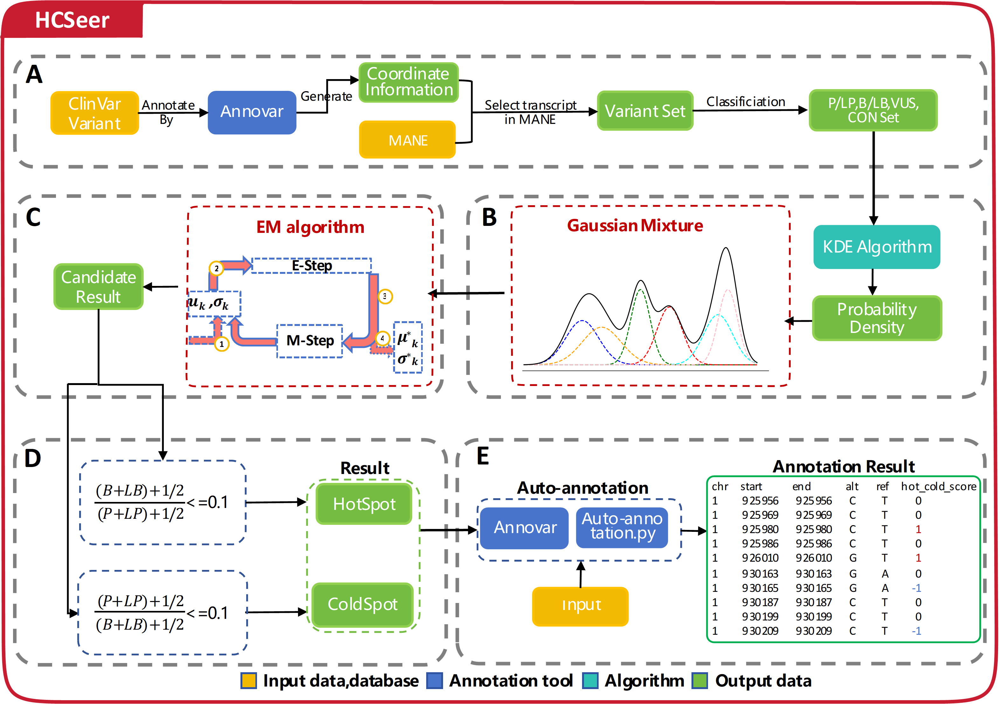

# [HCSeer: A Classification Tool for Human Genetic Variant Hot and Cold Spots Designed for PM1 and Benign Criteria in the ACMG Guideline](https://genemed.tech/hcseer/)
[](https://numpy.org/doc/stable/reference/index.html)
[](https://pandas.pydata.org/)
[](https://scikit-learn.org/dev/index.html)
[](https://scipy.org/)
[](https://www.python.org/)

HCSeer employs the Kernel Density Estimation (KDE) algorithm and the Expectation-Maximization (EM) algorithm from machine learning to calculate the variant density on the amino acid sequence of each gene and identify potential hot and cold spot regions.
<div align="center">
  
</div>

 
## Python packages that need to be installed
1. numpy (v>=1.26.4)
2. pandas (v>=2.2.2)
3. scikit-learn (v>=1.4.2)
4. scipy (v>=1.13.1)
5. python (v>=3.6)

## Installation tutorial

These scripts do not require compilation.

## Annotate whether our variant is located in a cold hot spot regions
How to use `Auto-annotation.py` scripts to annotate whether our variants are located in cold and hot spot regions
```bash
python Auto-annotation.py -i /path/to/your/input.vcf -o /path/to/your/output.vcf -buildver hg38
```
## Other script purposes

- 00_database-processing.sh

    Preprocess the data in the Clinvar database
- 01_clinvar-annotation.sh

    Annotate preprocessed data with an annotator
- 02_annotation-data-processing.py

    Process the data generated by annotations
- 03_main.py

    Kernel density estimation algorithm
- 04_EM.py

    Maximum Expectation Algorithm
- 05_Initial-result-processing.py

    Process the initial result to obtain the final result
- 06_compute_p-value.py

    Calculate p-value
- 07_profile-coefficient.py

    Calculate contour coefficient
  
- hg19-to-hg38.sh

    Script for converting hg19 genome version coordinates to hg38 version
- inAutoPVS1.py

    Compared to AutoPVS1
- PP2_BP1_PM1_PS1.py

    Combining PP2, PM5, PS1, BP1
- process_function.py

    Some file processing functions
- result-analysis.py

    Result analysis

